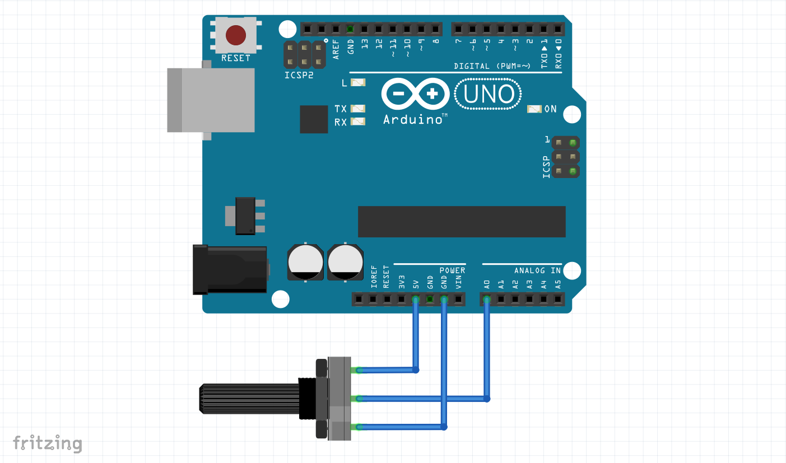

# Know your Arduino

## Board

## Pin Diagram

### Digital Pins

#### As Output

#### As input

The button's state is changed by the user by pressing it. not the arduino. The arduino reads the button's state so that it can determine whether it is pressed or not pressed.

In above image, when button is **open**, pin 5 will be reading HIGH and when it is **closed**, it will read LOW because current will flow towards *ground*.

### Anolog Pins

Analog in arduino is not actually analog. It is approximate to anolog. Read **Pulse Width Modulation**.

#### As Output

Same as LED. Check code.

#### As Input

