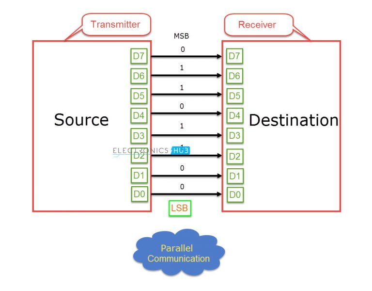
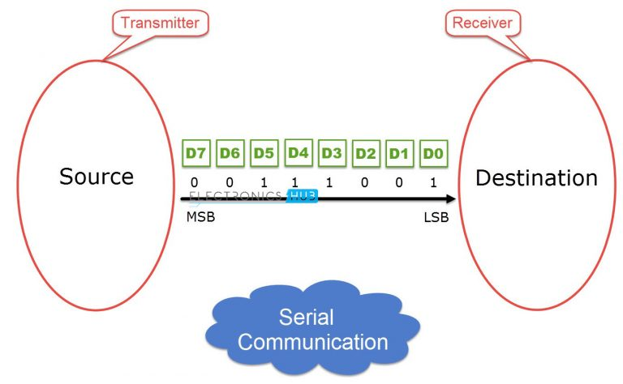
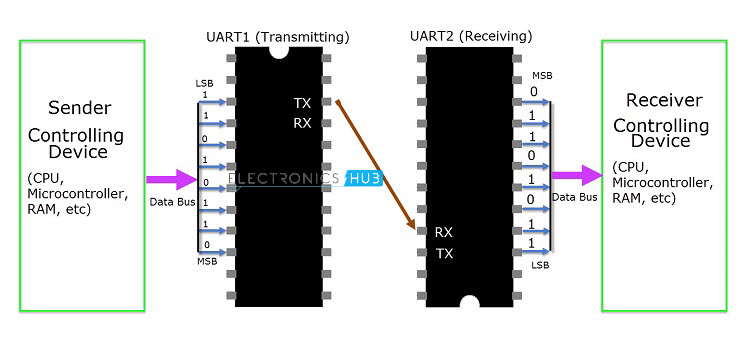
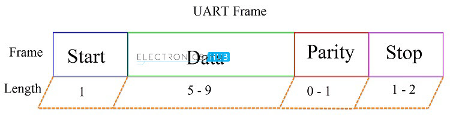
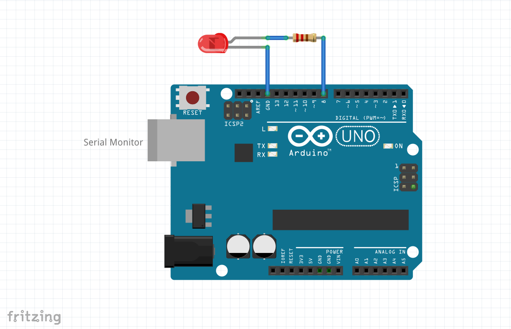

# Introduction to Communications

## Parallel Communication

All bits from source to destination are transferred at once. These methods are **faster & expensive** as they needs more hardware & wires.

*Credit: https://www.electronicshub.org/*

## Serial Communication

It transfers data bit by bit using a single line of wire. **For two way communication between the transmitter & receiver, we need just two wires**.

*Credit: https://www.electronicshub.org/*

### UART 

UART: *Universal Asynchronous Receiver Transmitter* is a dedicated hardware associated with serial communication. This device performs *parallel-to-serial* and *serial-to-parallel* conversion. It is universal because parametes like transfer speed, data speed can be configured. 

As it is asynchronous, **do not require clock**. UART uses special bits at the beginning & ending of each data word to synchronize transmitter & receiver.

The pin on the transmitting UART, which transmits the serial data is called TX and the pin on the receiving UART, which receives the serial data is called RX.

*Credit: https://www.electronicshub.org/*

**Start bit**: idle data line is HIGH. When tranmitter want to send, it makes it LOW. Change in value informs receiver that tranmission will start.

**Stop bit**: marks end of data packet. maintains data line at HIGH.

**Parity Bit**: To check received data is correct or not.

**Data bits**: Actual data. length anywhere between 5-9. Usually, LSB is the first bit of data.

## References

[[1] Basics of UART Communication](https://www.electronicshub.org/basics-uart-communication/)

[[2] Basics of I2C Communication | Hardware, Data Transfer, Configuration](https://www.electronicshub.org/basics-i2c-communication/)

[[3] Basics of Serial Peripheral Interface (SPI)](https://www.electronicshub.org/basics-serial-peripheral-interface-spi/)

[[4] PROTOCOLS: UART - I2C - SPI - Serial communications](https://www.youtube.com/watch?v=IyGwvGzrqp8)
