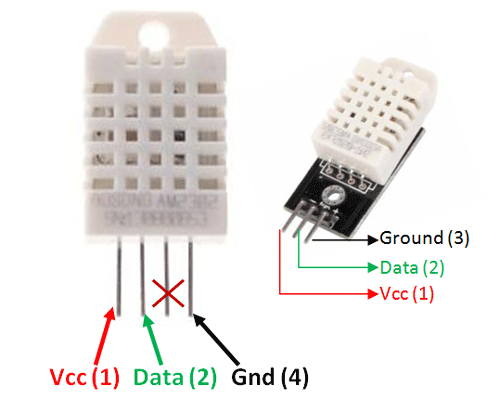
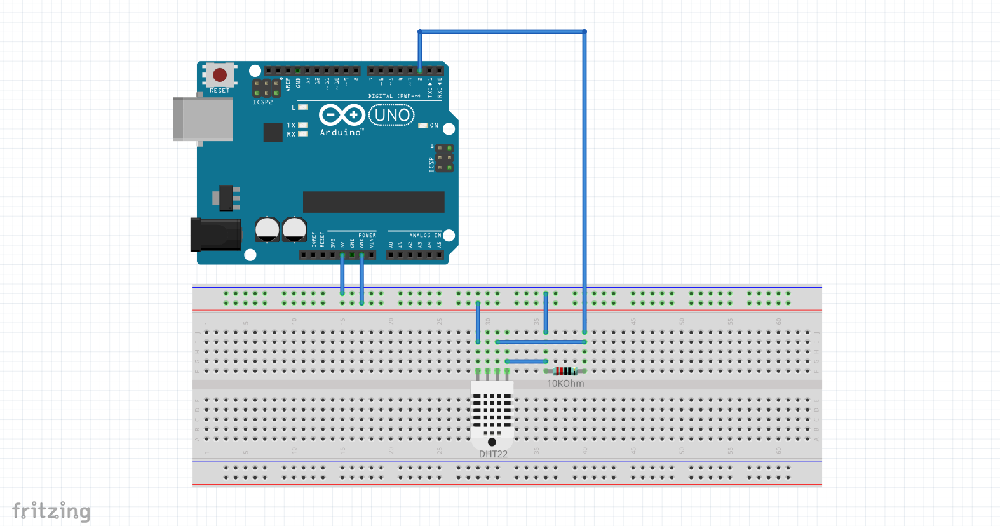
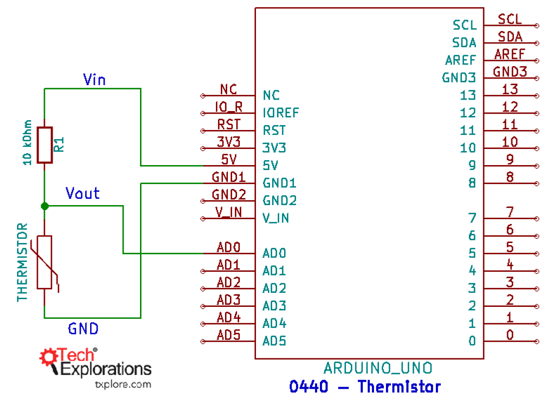
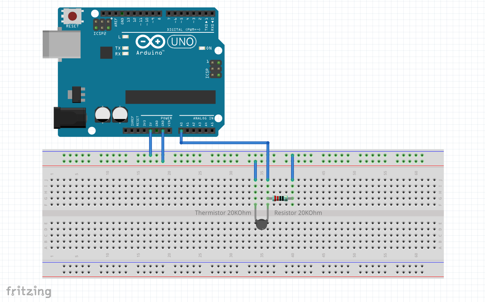

# Measuring temperature, humidity and pressure

## DHT22

**Pull up or pull down resistor**: In electronic logic circuits, a pull-up resistor or pull-down resistor is a resistor used to ensure a known state for a signal. It is typically used in combination with components such as switches and transistors, which physically interrupt the connection of subsequent components to ground or to VCC.

## Thermistor

Negative Temperature Coefficient (NTC) or Positive Temperature Coefficient (PTC)

Check Diagram below. We have to measure `Vout` voltage using analog pin.

Fritzing Circuit Diagram

